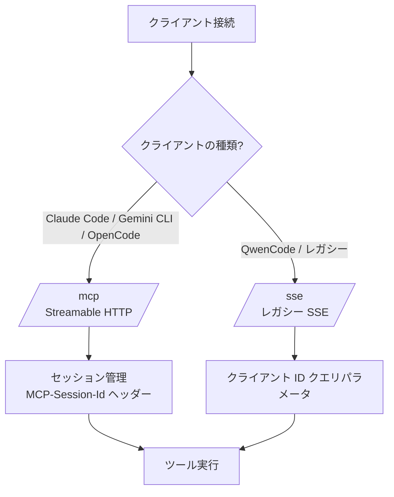

# MCP Windows Screen Capture Server

Windows 11 向けのスクリーンキャプチャ MCP サーバー。`--ip_addr`、`--port`、`--desktopNum` オプションに対応。

> **⚠️ 実装メモ:** これは **GDI+ 版** です。Direct3D なしで確実に動作します。高性能な GPU キャプチャが必要な場合は、Direct3D/Windows Graphics Capture を自分で実装してください。この GDI+ 版は AI アシスタント用途には十分な速度です。

## 動作要件
- Windows 11（または Windows 10 1809 以降）
- .NET 8.0 SDK

## ビルド & 実行

```bash
# ビルド
dotnet build -c Release

# CLI オプション付きで実行（WSL2 接続には必須）
dotnet run -- --ip_addr 0.0.0.0 --port 5000 --desktopNum 0

# 単一ファイル公開
dotnet publish -c Release -r win-x64 --self-contained false /p:PublishSingleFile=true
```

## CLI オプション
- `--ip_addr`: バインドする IP（WSL2 接続には `0.0.0.0`、ローカルのみは `127.0.0.1`）
- `--port`: ポート番号（デフォルト: 5000）
- `--desktopNum`: デフォルトモニター番号（0=プライマリ、1=セカンダリなど）

## デュアルトランスポート対応

このサーバーは最大の互換性のため、両方のトランスポートプロトコルをサポートしています：

| トランスポート | エンドポイント | ステータス | 用途 |
|-----------|----------|--------|----------|
| **Streamable HTTP** | `/mcp` | ✅ 新標準 | Claude Code, Gemini CLI, OpenCode |
| **レガシー SSE** | `/sse` | ⚠️ 非推奨 | QwenCode, 古いクライアント |

### トランスポート選択フロー



### AI エージェント設定マトリクス

| AI エージェント | トランスポート | 設定例 |
|----------|-----------|----------------|
| **Claude Code** | Streamable HTTP | `url: "http://127.0.0.1:5000/mcp"` |
| **Gemini CLI** | Streamable HTTP | `url: "http://127.0.0.1:5000/mcp"` |
| **OpenCode** | Streamable HTTP | `url: "http://127.0.0.1:5000/mcp"` |
| **QwenCode** | レガシー SSE | `url: "http://127.0.0.1:5000/sse"` |

## 利用可能な MCP ツール

### スクリーンキャプチャツール

| ツール | 説明 |
|--------|------|
| `list_monitors` | 利用可能なモニター/ディスプレイの一覧を取得 |
| `see` | 指定したモニターのスクリーンショットを撮影（目で見るような感覚） |
| `start_watching` | 連続的な画面キャプチャストリームを開始（ライブ映像のようなもの） |
| `stop_watching` | 実行中の画面キャプチャストリームを停止 |

### ウィンドウキャプチャツール

| ツール | 説明 |
|--------|------|
| `list_windows` | 表示されている Windows アプリケーションの一覧を取得（hwnd, タイトル, 位置, サイズ） |
| `capture_window` | 特定のウィンドウを HWND（ウィンドウハンドル）で指定してキャプチャ |
| `capture_region` | 任意の画面領域をキャプチャ（x, y, width, height） |

### ツール使用例

Claude に以下のように尋ねてみてください:
- 「今画面に何が映ってる？」
- 「モニター1を見て」
- 「開いているウィンドウを一覧表示して」
- 「Visual Studio のウィンドウをキャプチャして」
- 「(100,100) から (500,500) の領域をキャプチャして」
- 「画面を監視して、変化があったら教えて」

### ツールパラメータ例

```json
// ウィンドウ一覧を取得
{"method": "list_windows"}

// 特定のウィンドウをキャプチャ
{"method": "capture_window", "arguments": {"hwnd": 123456, "quality": 80}}

// 領域をキャプチャ
{"method": "capture_region", "arguments": {"x": 100, "y": 100, "w": 800, "h": 600}}
```

## アーキテクチャ & 実装

### リファクタリング履歴

| バージョン | 変更内容 | ステータス |
|---------|---------|--------|
| v1.0 | 初版（SSE のみ実装） | ✅ マージ済 |
| v1.1 | ツール名（動詞）、inputSchema、エラーハンドリング | ✅ マージ済 |
| v1.2 | ユニットテスト、CI 改善 | ✅ マージ済 |
| v1.3 | グレースフルシャットダウン（IHostApplicationLifetime） | ✅ マージ済 |
| v1.4 | **デュアルトランスポート**（Streamable HTTP + SSE） | ✅ マージ済 |
| v1.5 | **ウィンドウキャプチャ**（list_windows, capture_window, capture_region） | ✅ マージ済 |

### 主な機能

- **デュアルトランスポート対応**: Streamable HTTP（新）と SSE（レガシー）の両方に対応し、最大のクライアント互換性を実現
- **セッション管理**: MCP-Session-Id ヘッダーによる自動クリーンアップ
- **ウィンドウ列挙**: EnumWindows API で表示中のアプリケーションを一覧表示
- **領域キャプチャ**: CopyFromScreen を使用した任意の画面領域キャプチャ
- **グレースフルシャットダウン**: Ctrl+C やプロセス終了時の適切なクリーンアップ
- **エラーハンドリング**: 意味のあるエラーメッセージを含む包括的な try-catch ブロック
- **CI/CD**: 自動テスト付き GitHub Actions

## クライアント設定例

### Streamable HTTP（Claude Code / Gemini CLI / OpenCode）

```json
{
  "mcpServers": {
    "windows-capture": {
      "url": "http://127.0.0.1:5000/mcp",
      "transport": "http"
    }
  }
}
```

### レガシー SSE（QwenCode）

```json
{
  "mcpServers": {
    "windows-capture": {
      "url": "http://127.0.0.1:5000/sse",
      "transport": "sse"
    }
  }
}
```

### WSL2（Windows ホスト経由）

```json
{
  "mcpServers": {
    "windows-capture": {
      "command": "bash",
      "args": [
        "-c",
        "WIN_IP=$(ip route | grep default | awk '{print $3}'); curl -N http://${WIN_IP}:5000/sse"
      ]
    }
  }
}
```

## 初回セットアップ（ファイアウォール）

PowerShell（管理者権限）で実行:

```powershell
# WSL2 サブネットのみ許可（セキュア）
netsh advfirewall firewall add rule name="MCP Screen Capture" dir=in action=allow protocol=TCP localport=5000 remoteip=172.16.0.0/12

# 全ネットワークから許可（注意して使用）
netsh advfirewall firewall add rule name="MCP Screen Capture" dir=in action=allow protocol=TCP localport=5000
```

## セキュリティ考慮事項

- **Origin 検証**: Streamable HTTP エンドポイントは Origin ヘッダーを検証し、DNS リバインディング攻撃を防止
- **セッション分離**: 各クライアントは一意のセッション ID を取得し、自動的に期限切れ（1時間）
- **ローカルホストバインディング**: デフォルトで 127.0.0.1 にバインドし、外部アクセスを防止
- **WSL2 サポート**: WSL2 アクセスが必要な場合のみ `0.0.0.0` を使用

## トラブルシューティング

| 問題 | 解決方法 |
|-------|----------|
| 接続が拒否される | ファイアウォールルールを確認し、サーバーが実行中であることを確認 |
| /mcp で 404 エラー | デュアルトランスポート対応の最新ビルドを使用していることを確認 |
| 黒い画面が表示される | 管理者権限で実行 |
| ウィンドウが見つからない | ウィンドウが表示されていることを確認（システムトレイに最小化されていない） |

## ライセンス

MIT License - 詳細は LICENSE ファイルを参照してください。
