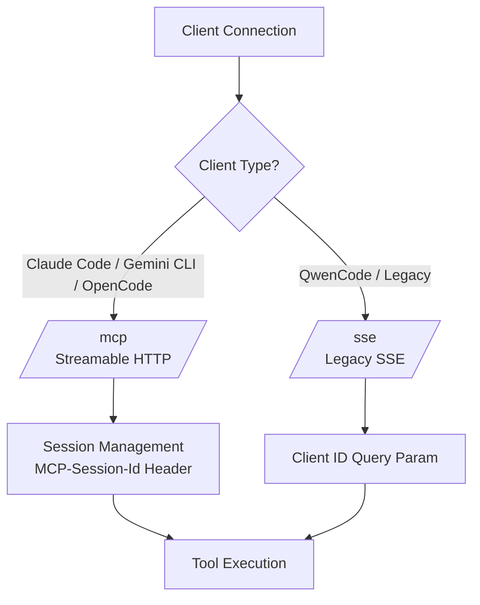

# MCP Windows Screen Capture Server

Windows 11 screen capture MCP server with `--ip_addr`, `--port`, `--desktopNum` CLI options.

> **⚠️ Implementation Note:** This is the **GDI+ version** which works reliably without Direct3D dependencies. If you need high-performance GPU capture, you must complete the Direct3D/Windows Graphics Capture implementation yourself. This GDI+ version is sufficient for most AI assistant use cases.

## Requirements
- Windows 11 (or Windows 10 1809+)
- .NET 8.0 SDK

## Build & Run

```bash
# Build
dotnet build -c Release

# Run with CLI options (Required for WSL2)
dotnet run -- --ip_addr 0.0.0.0 --port 5000 --desktopNum 0

# Or single-file publish
dotnet publish -c Release -r win-x64 --self-contained false /p:PublishSingleFile=true
```

## CLI Options
- `--ip_addr`: IP to bind (`0.0.0.0` for WSL2 access, `127.0.0.1` for local only)
- `--port`: Port number (default: 5000)
- `--desktopNum`: Default monitor index (0=primary, 1=secondary, etc.)

## Dual Transport Support

This server supports both transport protocols for maximum compatibility:

| Transport | Endpoint | Status | Best For |
|-----------|----------|--------|----------|
| **Streamable HTTP** | `/mcp` | ✅ New Standard | Claude Code, Gemini CLI, OpenCode |
| **Legacy SSE** | `/sse` | ⚠️ Deprecated | QwenCode, older clients |

### Transport Selection Flow



### AI Agent Configuration Matrix

| AI Agent | Transport | Config Example |
|----------|-----------|----------------|
| **Claude Code** | Streamable HTTP | `url: "http://127.0.0.1:5000/mcp"` |
| **Gemini CLI** | Streamable HTTP | `url: "http://127.0.0.1:5000/mcp"` |
| **OpenCode** | Streamable HTTP | `url: "http://127.0.0.1:5000/mcp"` |
| **QwenCode** | Legacy SSE | `url: "http://127.0.0.1:5000/sse"` |

## Available MCP Tools

### Screen Capture Tools

| Tool | Description |
|------|-------------|
| `list_monitors` | List all available monitors/displays |
| `see` | Capture a screenshot of the specified monitor (like taking a photo with your eyes) |
| `start_watching` | Start a continuous screen capture stream (like watching a live video) |
| `stop_watching` | Stop a running screen capture stream by session ID |

### Window Capture Tools

| Tool | Description |
|------|-------------|
| `list_windows` | List all visible Windows applications (hwnd, title, position, size) |
| `capture_window` | Capture a specific window by its HWND (Window handle) |
| `capture_region` | Capture an arbitrary screen region (x, y, width, height) |

### Tool Examples

Ask Claude:
- "See what's on my screen"
- "Look at monitor 1"
- "List all open windows"
- "Capture the Visual Studio window"
- "Capture a region from (100,100) to (500,500)"
- "Start watching my screen and tell me when something changes"

### Tool Parameter Examples

```json
// List windows
{"method": "list_windows"}

// Capture specific window
{"method": "capture_window", "arguments": {"hwnd": 123456, "quality": 80}}

// Capture region
{"method": "capture_region", "arguments": {"x": 100, "y": 100, "w": 800, "h": 600}}
```

## Architecture & Implementation

### Refactoring History

| Version | Changes | Status |
|---------|---------|--------|
| v1.0 | Initial SSE-only implementation | ✅ Merged |
| v1.1 | Tool naming (verbs), inputSchema, error handling | ✅ Merged |
| v1.2 | Unit tests, CI improvements | ✅ Merged |
| v1.3 | Graceful shutdown (IHostApplicationLifetime) | ✅ Merged |
| v1.4 | **Dual Transport** (Streamable HTTP + SSE) | ✅ Merged |
| v1.5 | **Window Capture** (list_windows, capture_window, capture_region) | ✅ Merged |

### Key Features

- **Dual Transport Support**: Both Streamable HTTP (new) and SSE (legacy) for maximum client compatibility
- **Session Management**: MCP-Session-Id header with automatic cleanup
- **Window Enumeration**: EnumWindows API for listing visible applications
- **Region Capture**: Arbitrary screen region capture using CopyFromScreen
- **Graceful Shutdown**: Proper cleanup on Ctrl+C or process termination
- **Error Handling**: Comprehensive try-catch blocks with meaningful error messages
- **CI/CD**: GitHub Actions with automated testing

## Client Configuration Examples

### Streamable HTTP (Claude Code / Gemini CLI / OpenCode)

```json
{
  "mcpServers": {
    "windows-capture": {
      "url": "http://127.0.0.1:5000/mcp",
      "transport": "http"
    }
  }
}
```

### Legacy SSE (QwenCode)

```json
{
  "mcpServers": {
    "windows-capture": {
      "url": "http://127.0.0.1:5000/sse",
      "transport": "sse"
    }
  }
}
```

### WSL2 (via Windows host)

```json
{
  "mcpServers": {
    "windows-capture": {
      "command": "bash",
      "args": [
        "-c",
        "WIN_IP=$(ip route | grep default | awk '{print $3}'); curl -N http://${WIN_IP}:5000/sse"
      ]
    }
  }
}
```

## First Run (Firewall)

Run as Administrator in PowerShell:

```powershell
# For WSL2 subnet only (secure)
netsh advfirewall firewall add rule name="MCP Screen Capture" dir=in action=allow protocol=TCP localport=5000 remoteip=172.16.0.0/12

# For all networks (use with caution)
netsh advfirewall firewall add rule name="MCP Screen Capture" dir=in action=allow protocol=TCP localport=5000
```

## Security Considerations

- **Origin Validation**: Streamable HTTP endpoint validates Origin header to prevent DNS rebinding attacks
- **Session Isolation**: Each client gets a unique session ID with automatic expiration (1 hour)
- **Localhost Binding**: Default binding to 127.0.0.1 prevents external access
- **WSL2 Support**: Use `0.0.0.0` only when WSL2 access is required

## Troubleshooting

| Issue | Solution |
|-------|----------|
| Connection refused | Check firewall rules and ensure server is running |
| 404 on /mcp | Verify you're using the latest build with dual-transport support |
| Black screen | Run with Administrator privileges |
| Window not found | Verify window is visible (not minimized to tray) |

## License

MIT License - See LICENSE file for details.
